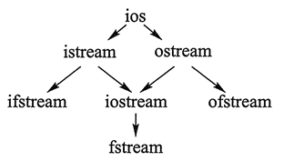

1. ios 是抽象基类。
2. istream 是用于输入的流类，cin 就是该类的对象，虚继承。
3. ostream 是用于输出的流类，cout 就是该类的对象，虚继承。
4. ifstream 是用于从文件读取数据的类。
5. ofstream 是用于向文件写入数据的类。
6. iostream 是既能用于输入，又能用于输出的类。
7. fstream 是既能从文件读取数据，又能向文件写入数据的类。

