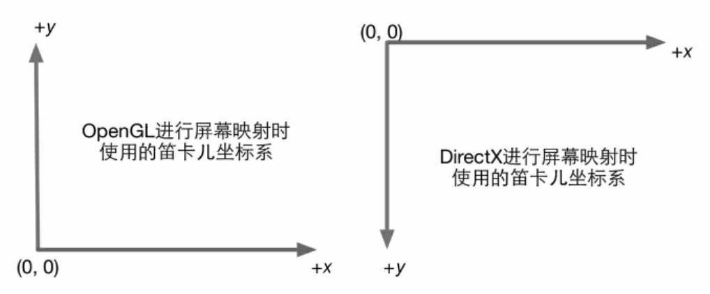
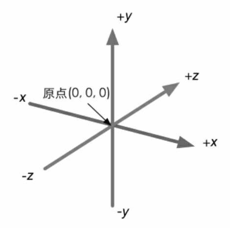
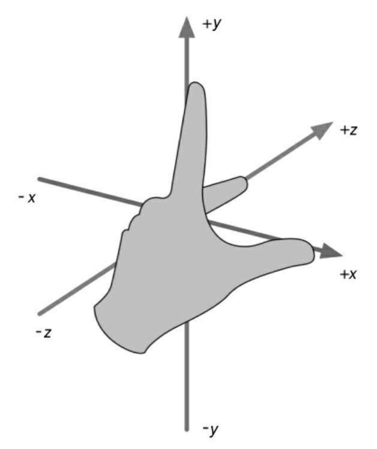
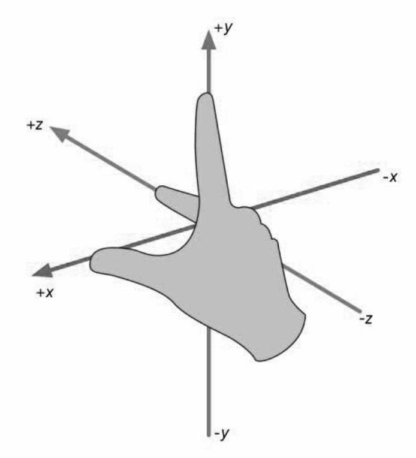
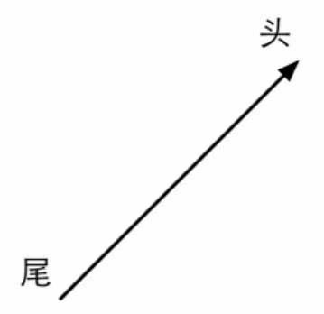
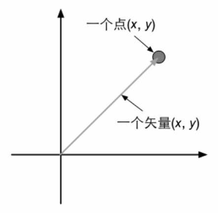

[LaTeX 符号](https://www.caam.rice.edu/~heinken/latex/symbols.pdf)

## 笛卡尔坐标系
### 二维笛卡尔坐标系

### 三维笛卡尔坐标系

3个轴也被称为该坐标系的基矢量(basis vector)。通常情况下，3个轴之间是互相垂直，且长度为1，这样的矢量被称为标准基矢量。互相垂直，但长度不为1的被称为正交基。

左手坐标系

右手坐标系

## 点和矢量

点(point)是n维空间中的一个位置，没有大小，宽度这类概念。在笛卡尔坐标系中，我们可以使用2个或3个实数来表示一个点的坐标，如P=(Px , Py)表示二维空间的点，p=(px, py, pz)表示三维空间中的点。

矢量(vector，也被称为向量)是指n维空间中一种包含了模(magnitude)和方向(direction)的有向线段。通常讲的速度就是一种典型的矢量。区别于标量(scalar)。一个矢量通常由一个箭头来表示。矢量的头指的是它的箭头所在的端点处。矢量用来表示对于某个点的便宜(displacement)。

### 矢量运算

#### 矢量和标量的乘除
我们不能把标量和矢量相加减。但可以对它们进行乘法运算。结果会得到一个不同长度且可能方向相反的新矢量。

KV = (KVx, KVy, KVz)

矢量也可以被一个非零的标量除，等同于和这个标量的倒数相乘。

$$\frac{v}{k} = \frac{x,y,z}{k} = \frac{1}{k}(x,y,z) = (\frac{x}{k},\frac{y}{k},\frac{z}{k}),k\neq0$$

例如:

$2(1,2,3)=(2,4,6)\qquad$ $-3.5(2.0)=(-7.0)\qquad$ $\frac{1,2,3}{2}=(0.5,1,1.5)$

#### 矢量的加减法
矢量加减法满足三角形定则(triaangle)。

$$
a+b=(a_{x}+b_{x},a_{y}+b_{y},a_{z}+b_{z})
$$

$$
a-b=(a_{x}-b_{x},a_{y}-b_{y},a_{z}-b_{z})
$$

### 矢量的模

$$
|V|=$\sqrt{{V_{x}}^{2}+{V_{y}}^{2}+{V_{z}}^{2}}
$$

### 单位矢量

$$\hat{V} = \frac{V}{|V|} ,V是任意非零矢量 $$ 

### 矢量的点积
矢量之间也可以进行乘法，矢量的乘法有两种最常用的种类:点积(dot product)和叉积(cross product)。
#### 点积运算
公式1

$$a\cdot b=(a_{x},a_{y},a_{z})\cdot(b_{x},b_{y},b_{z})=a_{x}b_{x}+a_{y}b_{y}+a_{z}b_{z}$$

矢量点击满足交换律:   

$$ a\cdot b = b\cdot a $$

性质一：点积可结合标量乘法。

$$ (ka)\cdot b=a\cdot (kb)=k(a\cdot b) $$

性质二：点积可结合矢量的加法和减法。

$$a\cdot(b+c) = a\cdot b+a\cdot c $$

性质三：一个矢量和本身进行点积的结果是该矢量的模的平方。

$$ V\cdot V = v_{x}v_{x}+v_{y}v_{y}+v_{z}v_{z}={|V|}^{2} $$

公式2

$$a\cdot b=|a||b|\cos\theta$$

#### 叉积运算

$$a\times b=(a_{x},a_{y},a_{z})\times(b_{x},b_{y},b_{z})=(a_{y}b_{z}-a_{z}b_{y},a_{z}b_{x}-a_{x}b_{z},a_{x}b_{y}-a_{y}b_{x}) $$

## 矩阵

$$M=
    \begin{bmatrix} 
        m_{11} & m_{12} & m_{13} \\
        m_{21} & m_{22} & m_{23} \\
        m_{31} & m_{32} & m_{33} \\
    \end{bmatrix}$$

## 矩阵的几何变换

## 坐标空间

## 法线空间