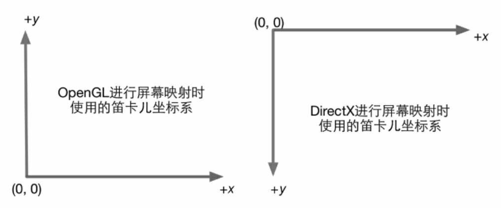
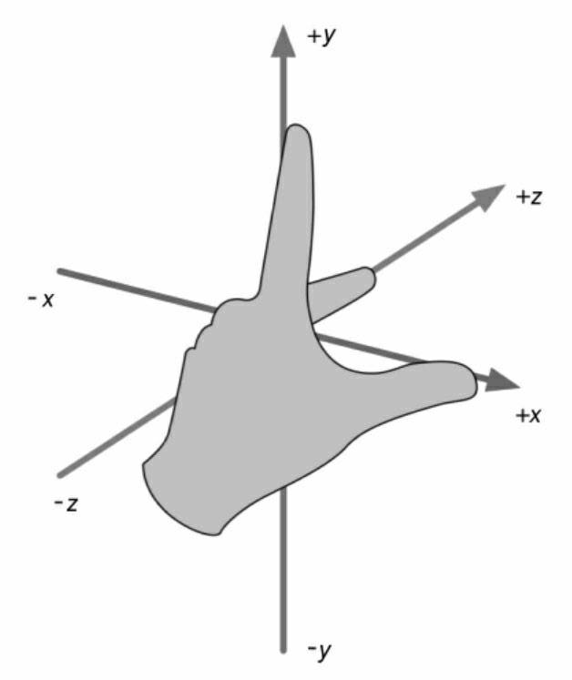
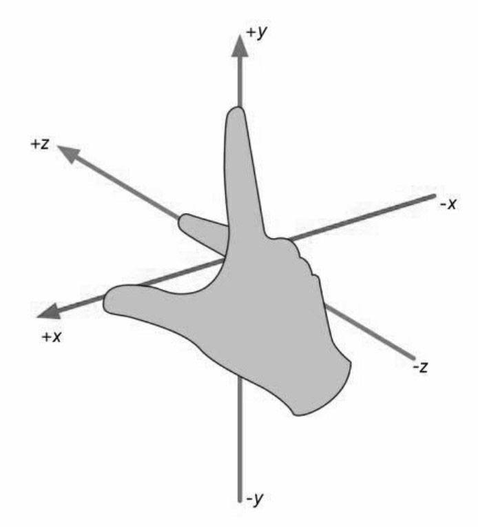
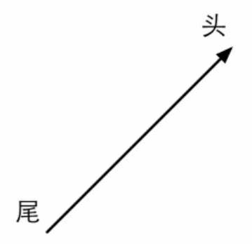

[LaTeX 符号](https://www.caam.rice.edu/~heinken/latex/symbols.pdf)

$$\sum_{i=0}^N\int_{a}^{b}g(t,i)\text{d}t$$ ， $$p(x|y) = \frac{p(y|x)p(x)}{p(y)}$$

## 笛卡尔坐标系
### 二维笛卡尔坐标系

### 三维笛卡尔坐标系

3个轴也被称为该坐标系的基矢量(basis vector)。通常情况下，3个轴之间是互相垂直，且长度为1，这样的矢量被称为标准基矢量。互相垂直，但长度不为1的被称为正交基。

左手坐标系

右手坐标系

## 点和矢量

点(point)是n维空间中的一个位置，没有大小，宽度这类概念。在笛卡尔坐标系中，我们可以使用2个或3个实数来表示一个点的坐标，如P=(Px , Py)表示二维空间的点，p=(px, py, pz)表示三维空间中的点。

矢量(vector，也被称为向量)是指n维空间中一种包含了模(magnitude)和方向(direction)的有向线段。通常讲的速度就是一种典型的矢量。区别于标量(scalar)。一个矢量通常由一个箭头来表示。矢量的头指的是它的箭头所在的端点处。矢量用来表示对于某个点的便宜(displacement)。

### 矢量运算
我们不能把标量和矢量相加减。但可以对它们进行乘法运算。结果会得到一个不同长度且可能方向相反的新矢量。

KV = (KVx, KVy, KVz)

矢量也可以被一个非零的标量除，等同于和这个标量的倒数相乘。

$$\frac{v}{k} = \frac{x,y,z}{k} = \frac{1}{k}(x,y,z) = (\frac{x}{k},\frac{y}{k},\frac{z}{k}),k\neq0$$

例如:

$2(1,2,3)=(2,4,6)\qquad$ $-3.5(2.0)=(-7.0)\qquad$ $\frac{1,2,3}{2}=(0.5,1,1.5)$

## 矩阵

## 矩阵的几何变换

## 坐标空间

## 法线空间