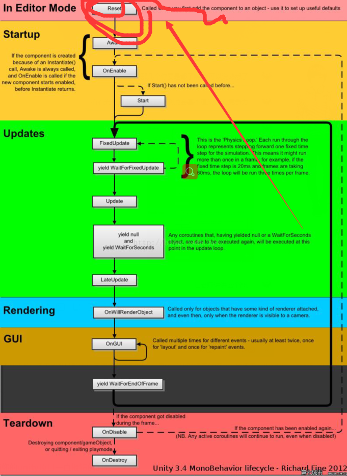

## unity基础
### unity工程结构
1. Assets 包含所有的工程文件，是主要工作的地方
2. Library 工程的数据库文件，可删除自动重建
3. ProjectSettings 工程的配置文件

### unity窗口
1. Hierarchy层级
2. Project工程
3. Inspector查看
4. Scene场景/Game游戏

### Unity脚本基础

1. Game Object最基础的游戏单位，一个最基本的Game Object仅包含一个Transform组件，用于对其进行位移，旋转和缩放。
2. MonoBehavior是所有Unity脚本的基类。
#### 脚本序列化
讲脚本指定给场景中的游戏体，就可在对应游戏体的Inspector窗口中配置脚本实例的public成员变量初始值。
默认只有继承自MonoBehaviour的脚本才能序列化。如果一个普通c#类需要序列化需要添加'[System.Serializable]'属性。
unity只能序列化public类型的变量，且不能序列化属性。

#### 组件式编程
1. 组件的获取
```c#
Rigidbody rigid = this.gameObject.GetComponent<Rigidbody>();
if(rigid==null)
{
    rigid = this.gameObject.AddComponent<Rigidbody>();
}
```
2. Unity消息机制在组件间通信
SendMessage函数(效率比较低)
```c#
//TestScript.cs
public class TestScript: MonoBehaviour{
    void Start(){
        this.gameObject.SendMessage("DoSomething");
    }
}
//DoSomethingScript.cs
public class  DoSomethingScript: MonoBeHaviour{
    public void DoSomething(){
        Debug.Log("DoSomething");
    }
}
```
2. 继承和组合
```c#
//TestScript.cs
public class TestScript:MonoBehaviour{
    void Start(){
        this.gameObject.GetComponent<DoSomethingBase>().DoSomething();
    }
}
//DoSomethingBase.cs
public class DoSomethingBase:MonoBehaviour{
    public abstract void DoSomething();
}
//DoSomethingScript.cs
public class DoSomethingScript:DoSomethingBase{
    public override void DoSomething(){
        Debug.Log("DoSomething");
    }
}
```
3. 协程编程
协程函数需要使用关键字IEnumerator定义，并一定要使用关键字yield返回。协程函数不能直接调用，需要使用函数StartCoroutine将协程函数作为参数传入。
```c#
using System.Collections;
using UnityEngine;
public class CoroTest:MonoBehaviour{
    void start(){
        Coroutine coro = StartCoroutine(DoSomethingDelay(1.5f));

        StartCoroutine(RunLoop());
    }
}
IEnumerator DoSomethingDelay(float sec){
    yield return new WaitForSeconds(sec);
    Debug.log("xxx");
    yield return new WaitForSeconds(sec);
    StartCoroutine(DoSomethingDelay(1.5f));
}
IEnumeraator RunLoop(){
    while(ture){
        Debug.log("xxx");
        yield return 0;
    }
}
```
### 预置文件Prefab和资源管理
当在场景中完成对Game Object的配置后，将其拖动到Object窗口中即创建了Prefab。
1. 删除场景中的实例不会影响到Project窗口中的Prefab。
2. 如果修改了场景中的实例，选择Inspector窗口右上角的Prefab->apple,Project窗口中保存的prefab则会自动同步到该修改的结果。
3. 如果修改了场景中的实例，选择Inspector窗口右上角的Prefab->Revert,则会返回到Prefab的设置中。
4. 如果修改了Prefab的某项设置，场景中的实例又没有修改过该项设置，场景中的实例则会自动同步到与Prefab相同的设置。
### 读取资源和实例化
```
GameObject go = new GameObject("Game Object Name");
```
使用new的方式非常直接，但在unity中只允许对一个空的Game Object使用关键字new进行创建。
```
public GameObject prefab;
public GameObject instance;
void start(){
    instance = Instantiate(prefab);
    Destroy(instance,0.1f);
}
```
在unity中不能直接使用c#标准库中的IO函数读取unity所需的资源，而是必须将资源放入名为Resources的文件夹中，unity运行有多个Resource文件夹且可以存放在工程中的不同位置。
```
void start(){
    GameObject prefab = Resource.Load<GameObject>("Player");
    instance = Instantiate(prefab);

    GameObject go =Resources.Load<GameObject>("Prefab名称");
    Texture texture = Resources.Load<Texture>("贴图名称");
}
```
### 时间和动画
任何和动画效果相关的参数，比如移动速度，旋转速度等，在使用前都需要与Time.deltaTime相乘，才能保证在不同帧数下取得相对一致的动画效果。

## Unity2D系统简介

## WEB服务器/tcp/udp

## IOS/Android移植

## UGUI

## 光照渲染物理材质等

## 行为树AI

## Shader特效

## Lua

## C#

## 一些游戏类型实例